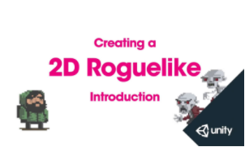

# roguelike
creating a  2D Roguelike game in unity
---
### 참고 강의  

[강의 사이트 이동하기](
https://www.inflearn.com/course/%EC%9C%A0%EB%8B%88%ED%8B%B0-3d-%EA%B2%8C%EC%9E%84-%EB%A7%8C%EB%93%A4%EA%B8%B0#)

1. 강좌 소개   
유니티 3D 로그라이크 게임 만들기 강좌입니다. 유니티 공식 듀토리얼 영상을 jemin_DEV 님꼐서 번역해 주셧습니다.   
짱짱!! 본 강좌에서는 기본 사용법 부터 판, 레벨, 움직임, 음향, 모바일 기기에서의 컨트롤까지 전반적인 내용을 차근차근 알려줍니다.   
이 유니티 3D 로그라이크 게임 만들기 강좌는 Unity 5 를 기준으로 만들어 졋지만, Unity 4.6 에도 충분히 적용가능합니다.    

Download the assets for free from the Asset Store here.   

##### 커리쿨럼
1. Introduction (만들게임 살펴보기)
2. Animations (애니메이션, 프리팹 만들기)
3. Tile Prefabs (판을 만들기 위한 추가요소들)
4. Board Manger (보드 매니저 스크립트 만들기)
5. Game Manger (게임 매니저)
6. Moving Objects 만들기
7. Walls (벽 스크립트 만들기)
8. Player Animator Controller (플레이어 애니메이터 컨트롤러 만들기)
9. Player Script (플레이어 캐릭터를 위한 스크립트 만들기)
10. Enemy Script (적 스크립트 만들기)
11. Enemy Animator Controller (적 애니메이터 컨트롤러 만들기)
12. UI & Levels 만들기
13. Audio (효과음 배경음 넣기)
14. Mobile (터치스크린 사용하기)
---
